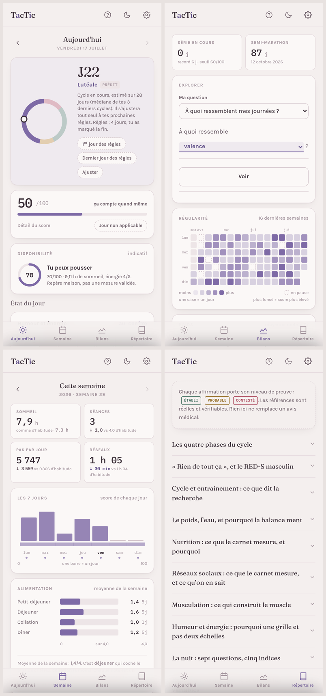

<div align="center">


# T<sub>a</sub>cT<sub>i</sub>c

**Carnet de suivi quotidien — sport, sommeil, humeur, alimentation, cycle.**

Un seul fichier. Aucun compte, aucun serveur, aucune publicité.
Les données ne quittent pas l'appareil.



</div>

---

## Ce que c'est

Un carnet quotidien qui tient dans un fichier HTML. Il s'ouvre dans n'importe quel navigateur, s'ajoute à l'écran d'accueil et fonctionne hors connexion. La saisie prend une minute par jour ; le reste se calcule tout seul.

Le nom dit le programme : **Tac** et **Tic**, les deux temps de l'horloge, dans le mot qui dit la tactique.

## Les quatre écrans

| | |
|---|---|
| **Aujourd'hui** | La saisie. Une grille affective pour l'humeur et l'énergie, le journal de la nuit, les séances, l'alimentation, les interactions, les réseaux. Un cadran affiche la phase du cycle, le trimestre de grossesse, ou rien selon la situation. |
| **Semaine** | Le point. Score moyen, séances, sommeil, pas, mensurations, le PANAS hebdomadaire, et deux champs libres : la victoire de la semaine, l'ajustement pour la suite. |
| **Bilans** | La lecture. L'explorateur, la régularité, le poids, l'humeur et le sommeil par phase, les interactions par phase, la progression de l'allure. |
| **Répertoire** | Les explications. Ce que mesure chaque échelle, et ce que dit — ou ne dit pas — la recherche. |

## Ce qui le distingue

**L'explorateur parle français.** Trois phrases, les menus dedans, aucun terme technique :

> Est-ce que **le type de séance** joue sur **ma valence** **le même jour** ?

Il n'y a pas de calcul à choisir. Le menu accepte aussi bien une catégorie qu'une quantité, et le carnet fait ce qu'il faut : comparer des groupes, ou chercher si les deux suivent la même pente. La phrase est le calcul.

**Les seuils sont personnels, jamais des normes.** Les comparaisons coupent à la médiane des propres journées. Aucun « deux heures maximum », aucun « 10 000 pas ou rien ».

**Le barème se modifie.** Cinq profils — Équilibre, Endurance, Musculation, Perte de graisse, Reprise en douceur — répartissent les mêmes 120 points, plafonnés à 100 : une journée parfaite n'exige jamais de tout cocher.

**Chaque réponse est dessinée**, jamais réduite à un chiffre. Histogramme pour une répartition, bandes de points pour une comparaison, nuage et droite pour un lien, série et pente pour une tendance. **Un point par jour, jamais un résumé** : c'est le recouvrement des nuages qui dit « c'est petit », mieux que n'importe quelle valeur p. Toutes les échelles sont écrites, aucune n'est tronquée.

**La progression physique se lit sur deux axes séparés**, jamais fusionnés : l'allure brute et l'allure à effort perçu égal. Aucune n'est fiable seule ; c'est leur écart qui informe.

**Le cycle se calcule à rebours.** L'ovulation est replacée depuis les règles suivantes : la phase lutéale est stable, la folliculaire ne l'est pas. Les cycles irréguliers s'absorbent tout seuls.

**Chaque affirmation du Répertoire porte son niveau de preuve** — établi, probable, contesté — et ses références réelles, avec DOI. Y compris quand elles contredisent ce que le carnet mesure : le « cycle syncing » y est présenté pour ce qu'il est, une pratique populaire à la base de preuves mince.

## Les instruments

Le carnet ne bricole pas ses échelles quand il en existe de validées :

- **Grille affective** — modèle circomplexe de Russell : valence × activation, quatre quadrants nommés.
- **PANAS** — Watson, Clark & Tellegen : affect positif et négatif, deux dimensions largement indépendantes, une fois par semaine dans sa fenêtre validée.
- **Consensus Sleep Diary** — Carney et al. : le journal de sommeil standard, dont sortent le temps de sommeil, le temps au lit et l'efficacité.
- **Rochester Interaction Record** — Wheeler & Nezlek : d'où viennent le seuil de dix minutes et la catégorisation par interlocuteur.

## Les données

Elles vivent dans le navigateur, sur l'appareil, et nulle part ailleurs. Pas de compte, pas de serveur, pas de requête sortante.

Le fichier peut donc s'envoyer à qui on veut : **les données ne voyagent pas avec lui**. Chaque personne remplit le sien.

L'écran des réglages affiche l'état réel du stockage, plutôt qu'une promesse :

```
Enregistrées dans    ce navigateur, sur cet appareil
Origine              exemple.fr
Envoyées à           personne — aucune requête sortante
Ouvert depuis        l'écran d'accueil
Dernière sauvegarde  il y a 3 jours
```

Export JSON pour la sauvegarde complète, CSV pour analyser ailleurs.

## Installation

**iPhone** — ouvrir l'adresse dans **Safari**, bouton Partager, *Sur l'écran d'accueil*. **Avant de commencer à remplir** : Safari efface le stockage d'un site après sept jours sans visite, et les applications de l'écran d'accueil en sont exemptées.

**Android** — ouvrir l'adresse, menu ⋮, *Ajouter à l'écran d'accueil*. Aucune règle équivalente.

**Ordinateur** — un marque-page suffit.

L'icône est **embarquée dans le fichier** : elle s'affiche même sur un `index.html` téléchargé seul, sans aucun fichier voisin.

## Déployer sa propre copie

1. Faire un fork de ce dépôt.
2. *Settings → Pages → Deploy from a branch → main / (root)*.
3. Attendre une minute.

Pour un nom de domaine, brancher le *Custom domain* **avant** de diffuser le lien : les données sont attachées à l'origine, en changer plus tard efface l'historique de tout le monde.

## Développement

Il n'y a pas de code caché : **`index.html` est la source**. Pas de build, pas de minification — ce qui est déposé est exactement ce qui s'exécute.

```bash
cd tools && npm install
npm test          # 111 vérifications, 6 suites
python3 logo.py   # régénère le logo et les icônes
node screenshots.mjs
```

Les tests valident notamment que **les modèles statistiques ne racontent pas d'histoires** : on simule une coureuse dont la forme est connue, on y injecte des dérives, et on vérifie que les deux axes disent la vérité. Détail dans [`tools/README.md`](tools/README.md).

## Compatibilité

iOS 15.4 et plus, Android récent, navigateurs de bureau à jour. En dessous, un écran l'explique au lieu d'afficher une page blanche.

## Ce que ce carnet n'est pas

Ce n'est pas un dispositif médical, et il ne prétend rien dépister. Le Répertoire résume des recommandations publiées ; il ne remplace aucune consultation. Les indicateurs maison — disponibilité du jour, signal de fatigue — sont signalés comme tels.

## Licence

**[GNU AGPL-3.0](LICENSE).** Le code et le contenu peuvent être lus, utilisés, modifiés et redistribués — à trois conditions : toute version modifiée reste sous AGPL-3.0, la mention de copyright est conservée, et **si une version modifiée est hébergée, son code source doit être publié**.

Cette dernière clause est la raison du choix : c'est elle qui empêche qu'on reprenne ce carnet, l'habille autrement et le vende sans jamais rien rendre.

Polices : [Fraunces](https://github.com/undercasetype/Fraunces), [Karla](https://github.com/googlefonts/karla), [IBM Plex Mono](https://github.com/IBM/plex) — sous SIL Open Font License.

